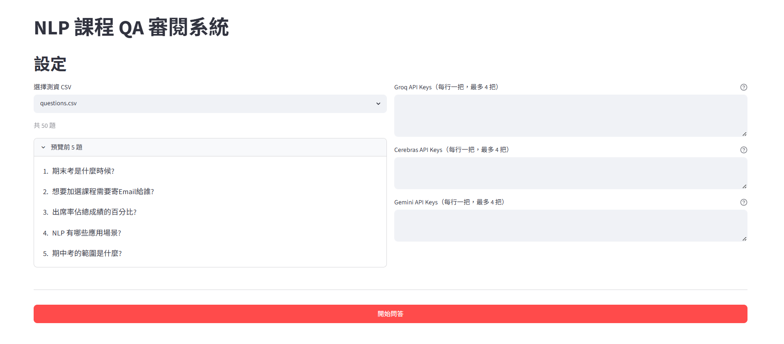

# NLP 課程 QA 系統

基於 BM25 檢索 + LLM 生成的課程文件問答系統。讀取 CSV 問題，從課程教材中檢索相關段落，透過 LLM 生成簡短精確的答案。

## 系統架構

```
問題 CSV → BM25 檢索 Top-k 段落 → LLM 生成答案 → 答案 CSV
```

答案產生依以下優先順序執行：

1. **Cache** — SHA-256 快取命中直接回傳（0 ms）
2. **規則層** — 高信心度（≥ 0.9）的日期 / 數值 / 定義直接抽取，跳過 LLM
3. **LLM 主要** — Groq `llama-3.3-70b-versatile`（高速 LPU 推論）
4. **LLM 第二主力** — Cerebras `gpt-oss-120b`（Free tier：1M TPD）
5. **LLM 備援** — Gemini `gemini-2.5-flash`（Groq / Cerebras 失敗時切換）
6. **句子選取** — 所有 LLM 均失敗時，從檢索段落中挑選最相關句子

## 專案結構

```
├── app.py                  # Streamlit 審閱介面
├── qa.py                   # CLI 主程式：批次 CSV → CSV
├── build_corpus.py         # 建立 BM25 索引
├── run.bat                 # 一鍵執行
├── run_ui.bat              # 一鍵執行 (UI版)
├── settings.json           # 系統設定
├── requirements.txt        # Python 套件相依
├── .env                    # API 金鑰（不納入版控）
│
├── corpus/                 # 課程教材
│   ├── slides/
│   ├── handouts/
│   └── transcripts/
│
├── input/
│   └── questions.csv       # 輸入問題
├── output/
│   └── answers.csv         # 輸出答案（含時間戳記）
├── data/
│   ├── bm25_cache.pkl      # BM25 索引快取
│   └── llm_cache.json      # LLM 回應快取
│
└── src/
    ├── answerer.py          # 答案產生管線
    ├── retriever.py         # BM25 + WAND 檢索
    ├── bm25_store.py        # BM25 索引儲存
    ├── chunker.py           # 文本切段（size=300, overlap=60）
    ├── tokenizer.py         # jieba 中文 + 英文 lowercase 分詞
    ├── parser.py            # 多格式文件解析
    ├── llm_client.py        # LLM 客戶端（Groq / Cerebras / Gemini / Router / KeyPoolClient）
    ├── cache.py             # LLM SHA-256 快取
    ├── post_process.py      # 答案後處理（去前綴、截斷）
    └── extractors/
        ├── factoid.py           # 日期 / 數值 / 人名抽取
        ├── definition.py        # 定義題抽取
        ├── enumeration.py       # 列舉題抽取
        └── sentence_picker.py   # 句子選取（LLM 失敗備援）
```

## 快速開始

### run.bat — 一鍵執行（CLI）

雙擊 `run.bat`，腳本自動完成以下流程：

1. **虛擬環境建置** — 自動檢查並建置 `venv`
2. **依賴套件安裝** — 靜默安裝 `requirements.txt` 中的所有套件
3. **金鑰引導** — 若無 `.env` 檔案，自動複製範本並以記事本引導填寫
4. **增量索引重建** — 自動比對 `corpus/` 教材修改時間與 `data/bm25_cache.pkl`；有更新才重構索引，否則跳過

---

### run_ui.bat — Streamlit 網頁審閱介面

雙擊 `run_ui.bat`，瀏覽器自動開啟網頁介面（預設：`http://localhost:8501`）



#### 步驟一：選擇測資與填寫 API 金鑰

在「設定」區塊中：

- **測資 CSV**：從下拉選單選擇 `input/` 底下的測資檔案；選取後顯示問題總數，可展開「預覽前 5 題」確認內容
- **Groq API Keys**：每行一把，最多 4 把；主要問答通路（`llama-3.3-70b-versatile`）
- **Cerebras API Keys**：每行一把，最多 4 把；第二主力通路（`gpt-oss-120b`）
- **Gemini API Keys**：每行一把，最多 4 把；最終備援通路（`gemini-2.5-flash`）

> 若 `.env` 中已設定 `GROQ_API_KEY` / `CEREBRAS_API_KEY` / `GEMINI_API_KEY`，啟動時會自動預填並提示「已偵測到 N 把金鑰」

#### 步驟二：執行批次問答

點擊「開始問答」按鈕。系統依金鑰池大小自動決定 `workers` 數並平行處理，進度條即時顯示 `平行執行中... (N/總題數)`，下方滾動狀態看板顯示最新完成題目

#### 步驟三：審閱結果指標

問答完成後，「結果」區塊呈現：

- **Layer Metrics 看板** — 統計各備援層命中數：

  | 指標 | 說明 |
  |------|------|
  | `cache` | SHA-256 快取命中（0 ms） |
  | `rule_factoid` / `rule_definition` | 規則層抽取，免除 LLM 呼叫 |
  | `llm` | 流經 Groq / Cerebras / Gemini 模型生成 |
  | `sentence_picker` | 降級選句 |

- **問答結果表格** — 互動式分頁表格，顯示每題的「問題」、「答案」、「Layer」，可搜尋與排序

#### 步驟四：匯出結果

- **自動儲存**：執行完成時已自動寫入 `output/`，檔名含時間戳記（如 `questions_20260612_120000.csv`）
- **網頁下載**：點擊「下載結果 CSV」按鈕直接匯出；輸出採 `utf-8-sig` 編碼，Excel 開啟無亂碼

## 設定說明（`settings.json`）

| 參數 | 預設值 | 說明 |
|------|--------|------|
| `chunk_size` | 300 | 文本切段大小（字元） |
| `chunk_overlap` | 60 | 段落重疊區域 |
| `top_k` | 7 | BM25 檢索段落數 |
| `bm25_min_score` | 0.5 | BM25 最低分數門檻 |
| `answer_max_chars` | 500 | 答案最大字元數 |
| `llm_max_tokens` | 1024 | LLM 輸出 token 上限 |
| `llm_timeout_seconds` | 30 | LLM 請求逾時（秒） |
| `gemini_rpm` | 10 | Gemini 每分鐘請求上限 |
| `workers` | 18 | CLI 並行處理線程數 |

## 技術細節

- **檢索**：BM25 + WAND 剪枝，jieba 中文斷詞 + 英文 lowercase
- **複合問句**：自動拆解多子問題，各子問題獨立檢索後合併上下文
- **多 key 平行**：Groq / Cerebras / Gemini 各 key 各自組成 `LLMRouter`，以 `ThreadPoolExecutor` 平行分流，吞吐量隨 key 數線性提升
- **LLM**：temperature=0，seed=42；Groq 主要 → Cerebras 第二主力 → Gemini 備援，`LLMRouter` 自動切換
- **速率限制**：每個 `GeminiClient` 實例維護獨立 token-bucket limiter，多 key 互不干擾
- **快取**：LLM 回應以 SHA-256(question + chunks) 為 key 快取至 JSON
- **後處理**：正規表達式去除常見答案前綴，依句子邊界截斷至 `answer_max_chars`
- **評分標準**：80% 答案正確性 + 20% 效率 / 簡潔度
